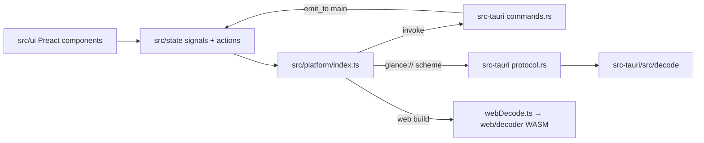

# Repository Guidelines

## Project Overview

Glance is a free, open-source viewer and light editor for PDFs, images, 3D models, and preview-only formats such as Office files, email, ebooks, and Markdown. It is a Windows app modeled on macOS Preview. It ships as a **Tauri 2 desktop app** (WebView2 with a Rust backend) and as a **browser web app** that uses the same frontend plus WASM decoders. The web app is hosted on GitHub Pages under `/app/`, next to the static landing site in `site/`.

Domain vocabulary lives in `CONTEXT.md`. Use those terms in UI text, code, and docs:
- **Markup**, not "annotation". "Annotation" is only the PDF storage term.
- **Version** means a saved state of a document. **Update** means a new release of Glance.
- **Text Recognition**, never "OCR" in the UI.
- **Redaction**, not "blackout".
- **Certificate Signature**, not "digital signature".
- **Document**, not "file" or "tab".

Design decisions are in `docs/adr/NNNN-*.md` (0001–0016). Add the next decision as `0017-*.md`.

## Architecture & Data Flow



- **Open flow:** `state/actions.ts` → `platform.probe` → Rust `probe`. The Rust side classifies the file by extension plus its first 16 bytes and returns `Probe{kind, browserNative, pages}`.
  - **PDF:** bytes arrive through `glance://file`. Then `pdf/engine.ts` `openPdf` (PDF.js) → `PdfDoc.load`. Edits use pdf-lib modules (`core/pageOps`, `annotations`, `redact`, `cleanup`, `pdfSign*`), which are lazy-loaded via `state/pdfModules.ts`.
  - **Image:** browser-native formats are served raw by `glance://file`; never re-encode them. Other formats go through `glance://decode?path&page&max`, which returns a BMP32. Editing runs in `image/engine.ts` with a Worker (`image/worker.ts`). The pure image math is in `core/image/*`.
  - **Model:** `model/viewer.ts`, built on three.js.
  - **Other formats:** `src/preview/*`, registered in `core/previews.ts` `PREVIEWS`. HTML is sanitized in `sanitize.ts`.
- **IPC:**
  - The frontend calls Tauri commands with `invoke`. Binary bodies are sent as the raw request body, with URL-encoded headers such as `x-path`.
  - Bulk bytes go through the `glance://` custom scheme.
  - Rust sends events to the webview with `emit_to('main', …)`: `open-files`, `shell-request`, `activate-file`, `mcp`, `agent`, `speech`.
- **Decoding (ADR 0010, native-first):** `decode/wic.rs` (Windows WIC) runs first. Then pure-Rust decoders: `image` crate, bmp, psd, raw_preview, eps, archive (CBZ). `decode/formats.rs` holds `classify` and `is_browser_native`.
- **Rust code shared by `#[path]`:**
  - `src-tauri/mcp-bridge` includes `src/mcp/endpoint.rs`.
  - `src-tauri/thumbnailer` and `web/decoder` include `src/decode`.
  - Keep those files self-contained: they must not depend on Tauri app state.
- **MCP / AI apps (ADR 0014/0015):**
  - `glance-mcp` (`src-tauri/mcp-bridge`) is a stdio JSON-RPC bridge. It answers the handshake and tool list from `src/core/mcp/tools.json`, then relays tool calls to Glance over a loopback hub (`src-tauri/src/mcp/`).
  - Tool handlers live in `src/state/mcpTools.ts`.
  - Invariants:
    - Never modify input files.
    - AI text edits become matching markup, with Keep/Undo.
    - Redactions stay pending until the user applies them.
  - `PROTOCOL_VERSIONS` in the bridge must match `src/core/mcp/protocol.ts`; `tests/mcp.test.ts` checks this.
- **Ask AI sidebar:** `src-tauri/src/agents.rs` spawns ACP agent processes. The webview drives the protocol in `src/state/ai.ts`.
- **Editing model:**
  - Markup stays outside the PDF bytes until save, then is written as PDF annotations (ADR 0003).
  - Redaction rasterizes the area (ADR 0005).
  - Autosave plus version history: `autosave.ts`, `versions.ts` (ADR 0004/0006/0008).
  - Undo: `History<Snapshot>(40)` per document.

## Key Directories

| Path | Purpose |
|---|---|
| `src/ui/` | Preact components (`views/`, `sidebar/`, `markup/`, `image/`, `dialogs/`, `ai/`, `web/`) |
| `src/state/` | Module-level signals and user actions: `documents.ts`, `commands.ts`, `actions.ts`, `ui.ts`, `mcp*.ts` |
| `src/core/` | Pure logic with no DOM and no Tauri; this is what the tests cover |
| `src/platform/` | **Main OS bridge** (preferred boundary): `index.ts` (invoke wrappers, browser fallbacks), `webDecode.ts`, `log.ts` |
| `src/pdf/`, `src/image/`, `src/model/`, `src/preview/` | Engines for each document kind |
| `src/i18n/` | `t()`/`msg()` and `locales/<code>.json` |
| `src/styles/` | Plain CSS (`app.css`, `web.css`, `annotation-layer.css`); no CSS-in-JS |
| `src-tauri/src/` | Rust backend (`lib.rs`, `commands.rs`, `protocol.rs`, `decode/`, `mcp/`, `agents.rs`, `website.rs`) |
| `src-tauri/{mcp-bridge,thumbnailer}/` | Separate crates with their own lockfiles: the `glance-mcp.exe` bridge and the Explorer thumbnail DLL |
| `src-tauri/windows/` | NSIS hooks (`hooks.nsh`) and the generated `default-apps.nsh` |
| `web/` | `decoder/` (Rust → wasm32 crate) and the `sw.js` service-worker **template** (keep the `__CACHE__`/`__CORE__`/`__REST__` placeholders) |
| `site/` | Static marketing site. Most pages are **generated** (see below). |
| `scripts/` | Build, i18n, packaging, and site generators (run with `node`) |
| `packaging/` | MSIX (`pack.ps1`), Store listing, winget reference manifests |
| `tests/` | Vitest suites plus binary fixtures |

## Development Commands

```bash
npm ci                          # install (npm only; never hand-edit package-lock.json)
npm run dev                     # Vite on :1420 (frontend only)
npx tauri dev                   # desktop app (runs npm run dev)
npm run typecheck               # tsc --noEmit (strict); the only "lint"
npm test                        # vitest run
npm run build                   # typecheck + vite build → dist/
npx tauri build --bundles nsis  # Windows installer
npx tauri build                 # on Linux: RPM (src-tauri/tauri.linux.conf.json sets targets + ships glance-mcp)
node scripts/build-web.mjs      # web app → dist-web/ (needs: rustup target add wasm32-unknown-unknown)
npx vite preview --outDir dist-web
npm run i18n                    # translation coverage + hardcoded-string report
npm run i18n -- de fr           # create/sync locale catalogs
node scripts/build-format-pages.mjs     # regenerate site/ format pages + sitemaps
node scripts/packaging.ts nsis          # regenerate src-tauri/windows/default-apps.nsh
cd src-tauri && cargo test --locked     # also run in src-tauri/thumbnailer and src-tauri/mcp-bridge
```

The repo has no ESLint, Prettier, rustfmt, or clippy gate. Match the surrounding style.

## Code Conventions & Common Patterns

- **Preact, not React.** Use `jsxImportSource preact`; `react`/`react-dom` resolve to `preact/compat`.
- **State:**
  - Use module-level `@preact/signals` (`signal`, `computed`, `effect`). There is no Redux and no context.
  - Documents are classes (`BaseDoc` → `PdfDoc`/`ImageDoc`/`ModelDoc`/`PreviewDoc`/`NoticeDoc`) whose fields are Signals.
  - `docs`, `activeDoc`, `addDoc`, `removeDoc`, `findByPath` live in `state/documents.ts`.
- **Commands:** `state/commands.ts` is the single registry (`id, label, keys, run, enabled, checked, radio, visible`). It feeds the menu bar, toolbar, shortcuts, and shortcut editor. Add actions there, not as ad-hoc handlers. Shortcuts are Windows-first (`core/shortcuts.ts`).
- **Platform boundary:**
  - Prefer `src/platform/index.ts` (checks `isTauri`/`isWeb`) for OS/Tauri access in new code. Existing exceptions: `src/state/{ai,installCount,mcp,updates}.ts` dynamically import `@tauri-apps/api/app` for `getVersion`.
  - Platform flags in `src/platform/index.ts`: `isTauri`/`isWeb` (desktop vs browser), `isWindows`, `windowsShell = isTauri && isWindows` (Open With, default apps, wallpaper, share), plus `ocrAvailable`, `scanAvailable`, `signatureCheckAvailable`, `speechAvailable`. Command visibility: `DESKTOP_ONLY` / `WINDOWS_ONLY` lists in `src/state/commands.ts`.
  - Every feature must degrade or hide in the browser build and in the Linux desktop build. The web build has:
    - no Text Recognition, scan, Ghostscript, XPS, Certificate Signatures, or saved Signatures
    - save as download, with no autosave or history
  - Linux desktop lacks Text Recognition, scanning, Certificate Signatures, Windows shell hand-offs, speech, XPS and JPEG XR. HEIC decodes in the webview via libheif WASM (`usesHeifWasm`); saved signatures and AI keys use the Secret Service keyring (`src-tauri/src/keyring_store.rs`), never plaintext.
- **Paths:** compare/dedupe paths only through pure `src/core/paths.ts` (`pathKey`, `samePath`) with an explicit `PathPolicy`; platform/state pass `platform.pathPolicy`. Windows folds case and `\`; POSIX preserves both. `src/core/` never imports `src/platform`.
- **Adding a Rust command:**
  1. Write the fn in `src-tauri/src/*.rs`. It returns `Result<_, String>` (`map_err(|e| e.to_string())`) and runs heavy work in `spawn_blocking`.
  2. Register it in the `generate_handler!` list in `lib.rs`.
  3. Add a wrapper in `platform/index.ts`.
  4. Add a permission in `src-tauri/capabilities/default.json` if it needs a new plugin or API.

  Window commands take `tauri::Window`, not `WebviewWindow`. Gate Windows-only code with `#[cfg(windows)]`, and add any needed `windows` crate features in `Cargo.toml`. Serialize to JS with serde `camelCase`.
- **Errors in TS:**
  - Use async/await.
  - Show failures with `toast()` or `alertDialog()` from `state/ui.ts`.
  - Wrap long operations in `withBusy`.
  - Encrypted PDFs throw `PasswordRequired`.
  - Frontend console errors are forwarded to the Rust log (`platform/log.ts`).
- **i18n (ADR 0012):**
  - All UI text goes through `t('English text', {vars})`, or `msg()` for text outside components. **The English text is the key**, so rewording it orphans existing translations.
  - The argument must be a plain string literal. Placeholders are `{name}`; plurals use the ICU subset `{n, plural, …}`.
  - Exempt a line with an `// i18n-ignore` comment.
- **Naming:**
  - Components: `PascalCase.tsx`.
  - Hooks: `useXxx.ts`.
  - Logic and state modules: `camelCase.ts`.
  - Tests: `tests/<camelCaseModule>.test.ts`.
  - Rust: one module per feature.
- **Comments** explain *why* and cite ADRs (for example `// ADR 0010`).
- **Privacy:** any new network call must be optional, allowed in the `tauri.conf.json` CSP `connect-src`, and documented in `PRIVACY.md` and in the release notes' Privacy section. Never upload files and never send file names.

## Important Files

- **Entry points:**
  - `index.html` → `src/main.tsx` → `<App/>`.
  - `src-tauri/src/lib.rs` `run()` registers plugins, the `glance://` scheme, managed state, and the command list.
  - `src-tauri/src/main.rs` also acts as `glance-mcp` in the Store build.
- **Config:**
  - `vite.config.ts`: the `glance-pdfjs-assets` plugin copies pdfjs assets into the gitignored `public/pdfjs/`; vitest config.
  - `tsconfig.json`: strict, with `noUnusedLocals`/`noUnusedParameters`.
  - `src-tauri/tauri.conf.json`: CSP, NSIS, and `bundle.fileAssociations`, which drive installer, winget, MSIX, and thumbnail registration.
  - `src-tauri/capabilities/default.json`.
- **Version (keep in sync; currently 0.6.4):**
  - `package.json` and `package-lock.json` (update via npm, not by hand)
  - `src-tauri/Cargo.toml` and its `Cargo.lock` entry
  - `src-tauri/tauri.conf.json` (the release check reads this)
  - a `## New in X.Y.Z` heading in `.github/release-notes.md`
- **Release notes** (`.github/release-notes.md`): newest section first. Bullets use the form `- **Bold lead.** Plain user-facing text.` Describe fixes as user symptoms and avoid jargon.
- **Generated, do not hand-edit:**
  - `site/<slug>/index.html` and `site/sitemap.*`: edit `scripts/format-pages.mjs` (data) or `scripts/build-format-pages.mjs`, rerun the generator, and commit the output. `site/index.html` is hand-written and is the source of the shared styles.
  - `src-tauri/windows/default-apps.nsh`: regenerate with `node scripts/packaging.ts nsis`.
  - Signature fixtures: regenerate with `npx vite-node tests/signatures/make-fixtures.ts`.

### Adding a file format

1. **Rust decode:** add a match arm in `src-tauri/src/decode/mod.rs` and add the extension to `BACKEND_IMAGES` in `decode/formats.rs`. Update `metadata.rs` and `archive.rs` if relevant.
2. **Frontend lists:**
   - `WASM_IMAGES` in `src/platform/index.ts`
   - `OPEN_FILTERS` in `src/state/actions.ts`
   - `src/core/previews.ts`, for non-image formats
   - `src/image/batch.ts`
   - `src/core/explorer.ts`
3. **Association:** add the extension to `bundle.fileAssociations` in `tauri.conf.json`, then regenerate `default-apps.nsh`.
4. **Docs:** update `docs/FORMATS.md` and `README.md`. For a landing page, add an entry in `scripts/format-pages.mjs`, then run `build-format-pages.mjs`. Page claims must also be true for the browser version; Windows-only features must say "the Windows app".

## Runtime/Tooling Preferences

- **Node 22** with **npm**; there is no Bun or pnpm. `scripts/*.ts` run directly with `node` (type stripping), not with ts-node.
- **Rust stable**, edition 2021, `rust-version 1.80`. Run cargo commands with `--locked`. There are four Cargo workspaces, each with its own lockfile: `src-tauri`, `src-tauri/thumbnailer`, `src-tauri/mcp-bridge`, `web/decoder`.
- Desktop targets: **Windows** (NSIS/MSIX) and **Linux RPM** (Fedora 42+, built in a `fedora:42` container; glibc of the build image sets the floor). Linux-only bundle config lives in `src-tauri/tauri.linux.conf.json` and the launcher template `src-tauri/linux/glance.desktop` (MIME list kept in sync by `tests/packaging.test.ts`). WIC, XPS, OCR, speech, scanning and the Explorer thumbnailer need Windows.
- MCP endpoint (Unix): `$XDG_RUNTIME_DIR/glance` or `~/.local/state/glance`, must be a private 0700 dir owned by the user; `scripts/mcp-smoke.mjs` mirrors `endpoint::dir()`.
- `.gitattributes` marks `src-tauri/testdata/**` and `tests/signatures/*.pdf` as binary. Signed bytes must never be converted to CRLF.

## Testing & QA

- **Vitest**, `node` environment (no DOM). Tests live in a flat `tests/*.test.ts` and import from `../src/...` with relative paths (no alias). Run from the repo root, because fixtures are read with `readFileSync('tests/...')`.
  - Single file: `npx vitest run tests/pageOps.test.ts`.
  - Single test by name: `npx vitest run -t "name"`.
- **No mocks** (`vi.mock`/`vi.fn` are unused). Tests call pure `core`/`model`/`image`/`platform` functions with real inputs. Helpers in `tests/fixtures.ts`:
  - `labeledPdf(n)`
  - `RED_PNG`
  - `reveals(bytes, secret)` (checks that redacted text is really gone)
- Binary fixtures go under `tests/<kind>/`; Office files are gzipped. UI components have no render tests.
- **Repo-consistency tests** fail when generated output is stale:
  - `sitePages.test.ts`: site pages; also enforces alt text, description length 25–160, title length ≤70
  - `packaging.test.ts`: `default-apps.nsh` and winget output
  - `version.test.ts`
  - `i18n*.test.ts`

  When one fails, rerun the generator; don't edit the test.
- **Rust tests** are inline `#[cfg(test)] mod tests` at the bottom of each file. `src-tauri/testdata` is loaded with `include_bytes!`.
- **CI** (`.github/workflows/ci.yml`) skips code jobs on docs-only changes. It runs:
  - typecheck, test, and vite build
  - a web build check
  - Windows cargo tests, NSIS install, registry checks, and `node scripts/mcp-smoke.mjs`
  - MSIX pack, arm64 `cargo check`, Linux cargo test

  There is no coverage threshold. Before finishing, run `npm run typecheck && npm test`, plus `cargo test --locked` if you touched Rust.
